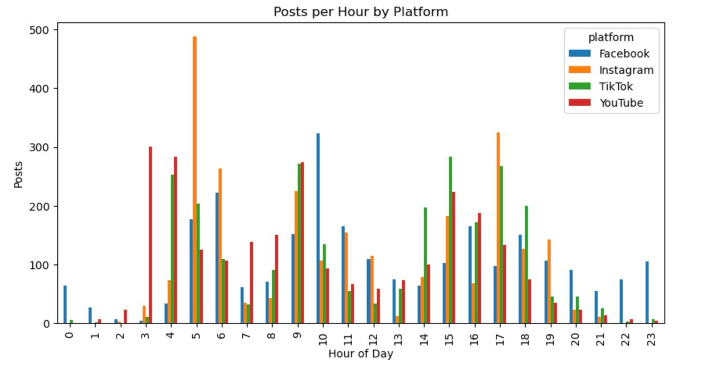
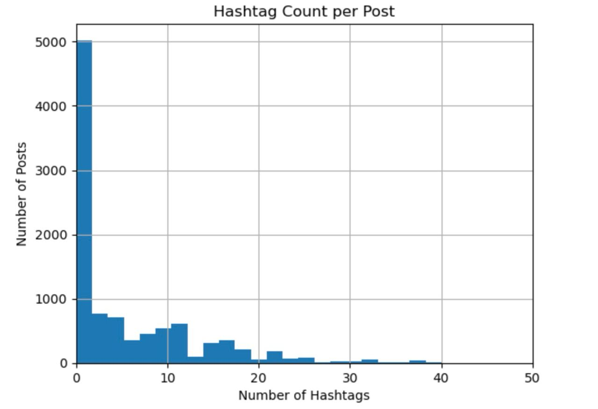
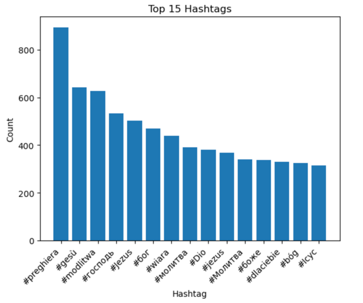
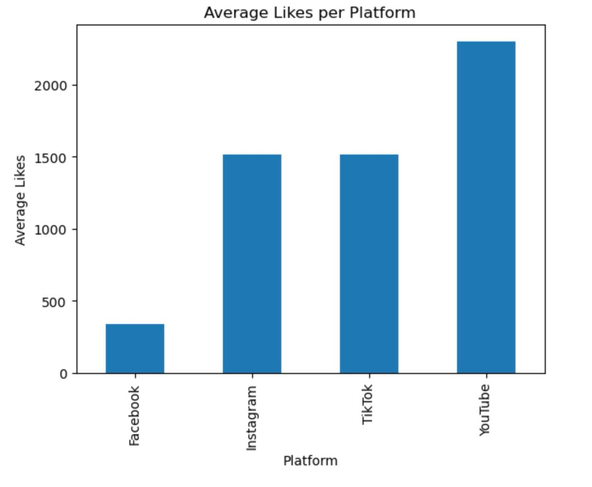

# Social Media Engagement EDA

Exploratory Data Analysis of social media posts across **Instagram, TikTok, Facebook, and YouTube**.

This project was completed as part of a data analytics technical assessment. The goal was to explore the dataset, identify patterns in posting behavior and engagement, and determine whether the data contains useful signals for further analysis.

📄 **Full Report:**
[social_media_eda_report.pdf](social_media_eda_report.pdf)

---

## Dataset

The dataset contains **10,000 posts** equally distributed across four platforms:

* Instagram
* TikTok
* Facebook
* YouTube

Each record includes:

* post timestamp
* post text
* likes
* comments
* shares
* views

Some engagement metrics are missing depending on the platform.

---

## Tools

* Python
* pandas
* matplotlib
* seaborn
* Jupyter Notebook

---

## Posting Activity by Hour



Posting activity is lowest during the night and peaks during daytime hours, especially in the morning and afternoon.

---

## Hashtag Usage



Most posts contain only a small number of hashtags, while a small number of posts contain many hashtags.

---

## Top Hashtags



Many frequently used hashtags are related to religious topics such as references to **God, prayer, and Jesus** across multiple languages.

---

## Average Likes by Platform



Engagement differs significantly between platforms. Facebook shows substantially lower average likes compared to Instagram, TikTok, and YouTube.

---

## Key Insights

* Posting activity varies strongly by **hour of day** but not significantly by **weekday**.
* Engagement metrics differ across platforms.
* **TikTok** contains the most complete engagement data.
* The dataset appears to be strongly centered around **religious content**.

These patterns suggest the dataset contains meaningful structure and could support deeper analysis.

---

## Repository Structure

```
social-media-engagement-eda
│
├── social_media_eda_report.pdf
├── social_media_eda.ipynb
├── README.md
├── requirements.txt
└── images/
```

---

## Note

The dataset used in this project was provided as part of a technical assessment and cannot be publicly distributed.
